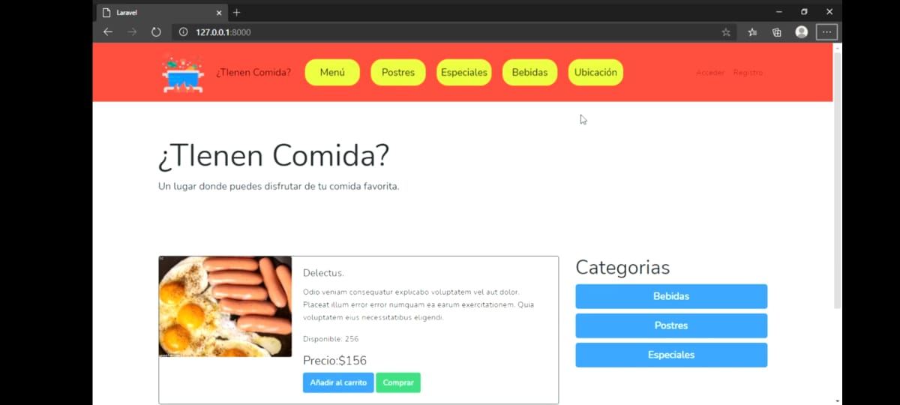
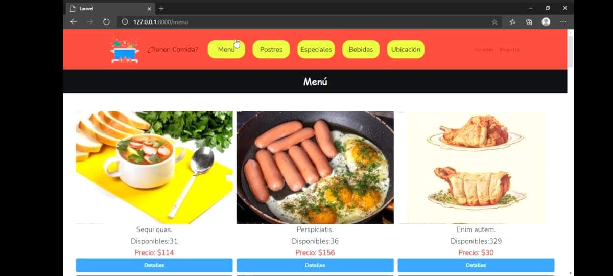
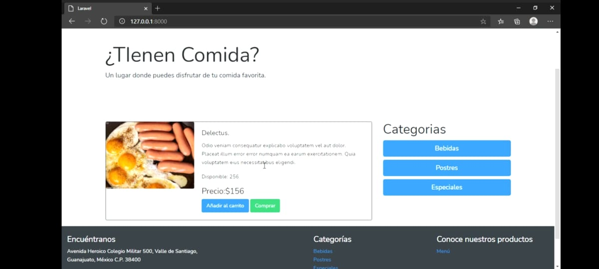
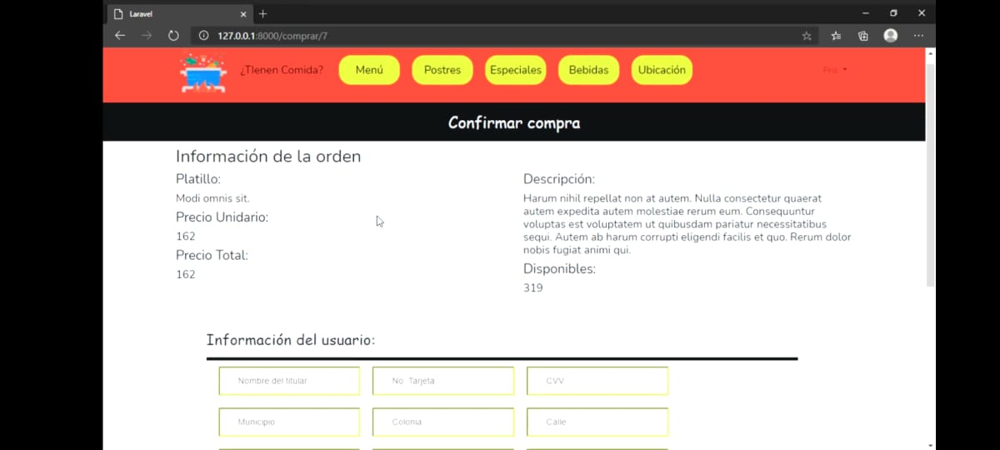
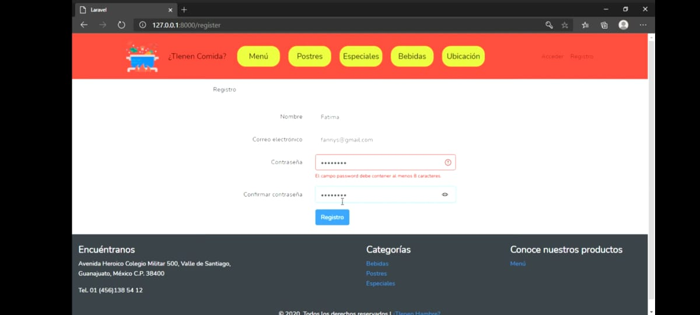

# TIenen Hambre

TIenen Hambre es una página para un negocio que quiera dar uso de la tecnología para entregar sus insumos, proporcionando una interfaz fácil de navegar para encontrar la comida ideal de acuerdo al cliente.

## Tecnologías
Aplicación web con el Framework **Laravel**, **html**, **css**, **bootstrap**, template engine **Blade**.
La aplicación cuenta con autenticación de usuarios, con una base de datos **MySQL**, con ayuda de faker vienen datos de prueba, con ayuda de migraciones, seeds y factories que proporciona Laravel .
Operaciones CRUD de acuerdo a los permisos y roles del usuario.
Incio de seción y registro de usuarios. 

## Instalación
Para poner en ejecución el proyecto es necesario:
Tener instalado un servidor web con Apache o NGINX, así como MYSQL, PHP y composer.

Instalar dependencias composer

 ```php composer.phar install ```

## Projecto en marcha







<!-- ## License
[MIT license](https://opensource.org/licenses/MIT). -->
